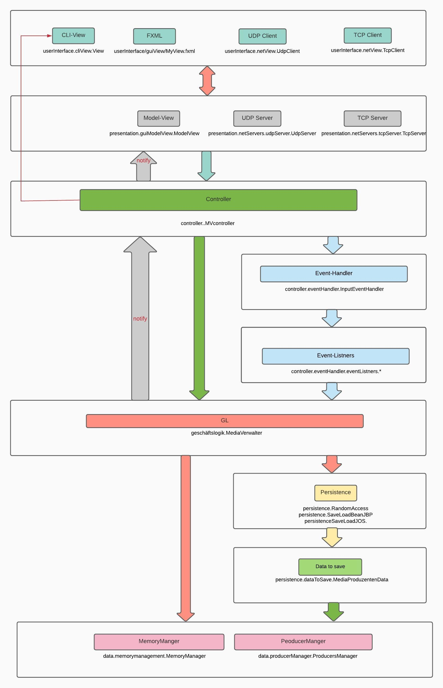

#Shichtenarchitektur:

###Begründung:

1.UserInterface Layer:
- Diese Schicht enthält die Benutzeroberfläche entweder CLI, GUI(FXML), UDP- oder TCP clients.
- FXML Delegiert Angaben der Benutzer zu Modelview.
- UDP client sendet Angaben der Benutzer zum UDP server.
- TCP clint Delegiert Angaben der Benutzer zum TCP server.
- CLI view Delegiert Angaben der Benutzer direkt zum controller.

2.presentation Layer:
- Diese Schicht kommuniziert mit UserInterface- und Controller-Schicht.
- ModelView schafft die Data binding und delegiert die Angaben der Bernuzer zum Controller.
- UDP- und TCP Server kommunizieren mit den clients und delegieren deren Angaben zum Controller.

3.Controller Layer:
- Der Kontroller ist das Hirn vom Program.
- Er nimmt die delegierten Anforderung und handelt die Anforderung in Geschäftslogik entweder durch EventHandler und Listners oder direkt in GL.
- Nachdem wird der Kontroller von GL mit den Änderungen benachrichtigt und dann diese signal wird an Präsentationsschicht durch Kontroller weitergeleitet oder an CLIView angezeigt.

4.Geschägtslogik-Schicht:
- Diese schicht organisiert manipuliert die zu speichernden in Datenbank Datein.
- GL hat Zugriff auf der Dantenbank und erledigt das speicherung oder die Ladung vom aktuellen Zustand durch speicherung von MediaProduzentenData "Data to save".
- Nachdem das Prozess erledigt ist, wird GL den Kontroller mit neuer Zustand benachrichtigen.

5.Data Layer:
- Diese Schicht enthält die Aktuellen Vorhanden Datei ode sozusagen unsere Datenbank.
- Memory manager ist zuständig für processing die hochgeladenen Medien.
- Producer manager ist zuständig für processing die vorhandenen Produzenten.

##Quellen:
https://docs.oracle.com/javase/tutorial/
https://stackoverflow.com/
https://www.geeksforgeeks.org/java/
https://www.tutorialspoint.com/design_pattern/data_access_object_pattern.htm
https://www.baeldung.com/mockito-series
https://www.baeldung.com/java-thread-safety
https://howtodoinjava.com/design-patterns/behavioral/observer-design-pattern/